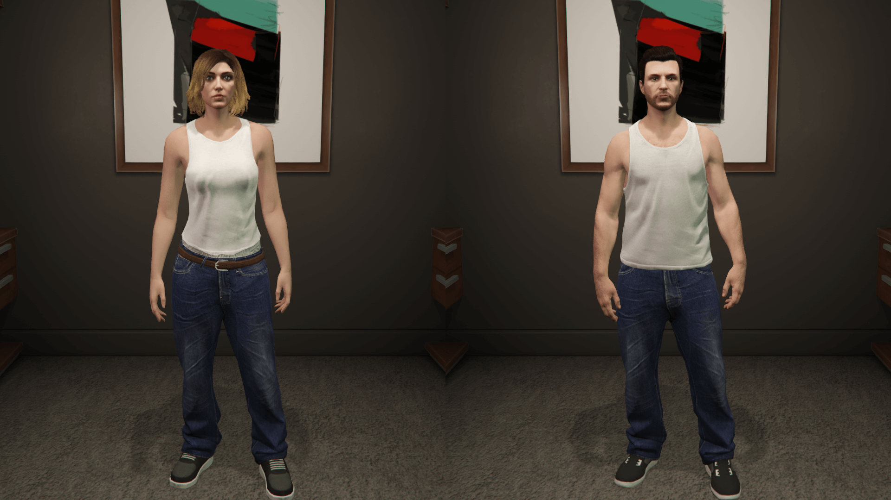
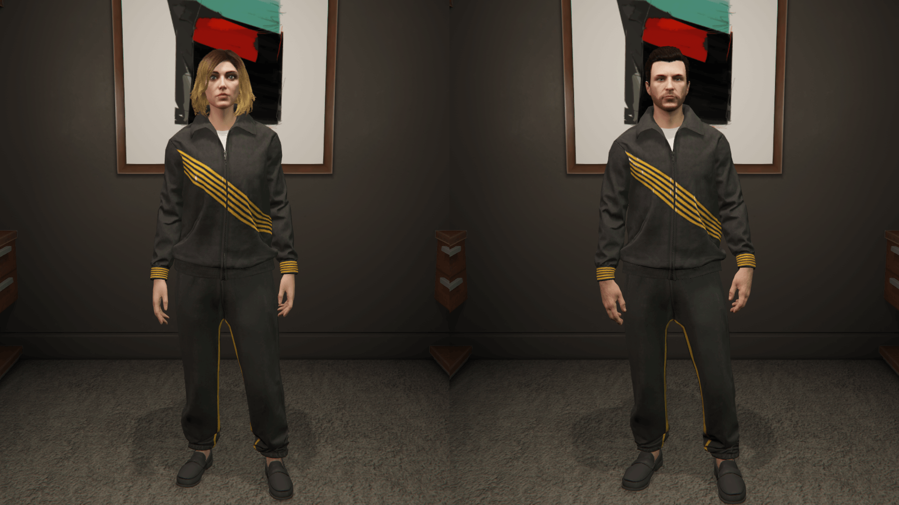
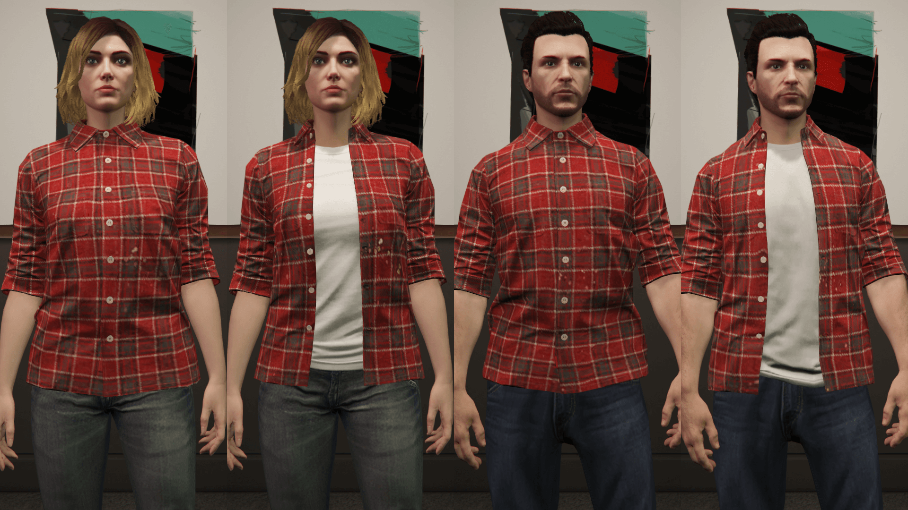
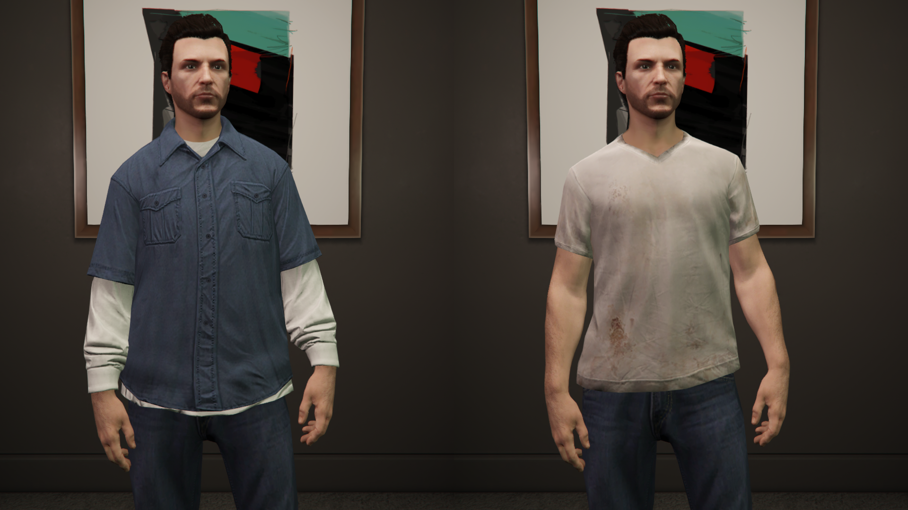
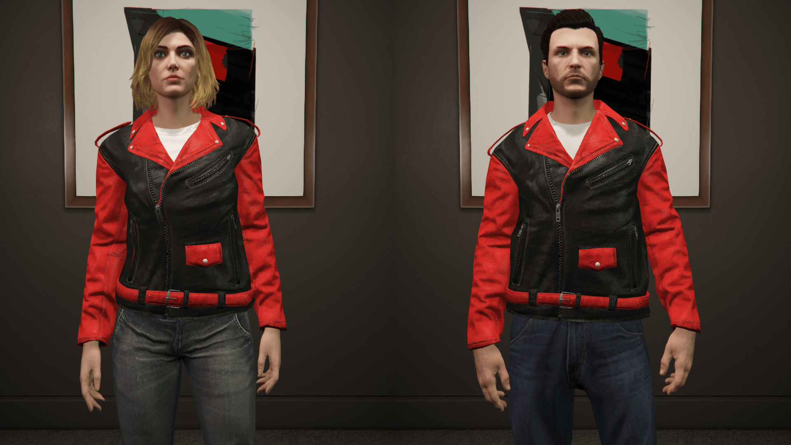
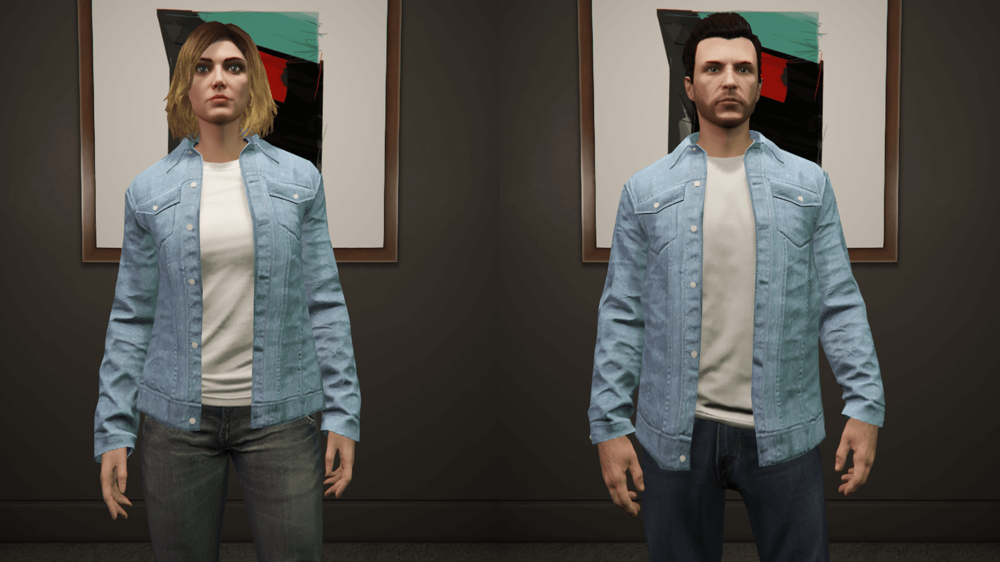
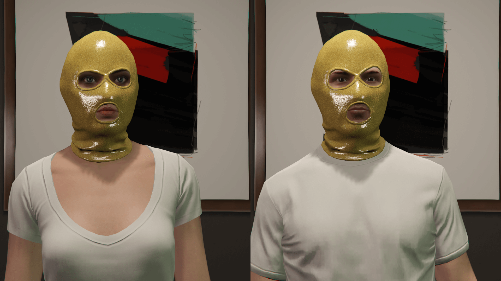

<h1 align="center">mpstubcloths</h1>

A simple FiveM conversion for [Alex106's mod on GTA5mods website](https://www.gta5-mods.com/player/mp-stub-clothes-patch), by TayMckenzieNZ.

## Information 📜
This mod replaces all the stub files of the MP characters clothes with "empty" drawables in order to prevent the game from crashing and makes scrolling past a certain ID work.

You will see the clothing number appear in your clothing menu, however will be able to scroll past it without crashing to the desktop / FiveM client.

## DLCs with stub files ⚠️
- mp2023_01
- mp2023_02
- mp2024_01
- mpg9ec
- mpsum2_g9ec


| | | |
|-|-|-|
|  |  |  |
|  |  |  |
|  |  |  |


## Installation 💾

To 'install' this into your FiveM server, simply drag and drop the `mpstubcloths` folder into your FiveM server's resources folder or wherever you have your usual 'EUP' organised.

Open your server.cfg file and add the following, ideally before any of your own personal custom clothing.

```cfg
ensure mpstubcloths
```

Like so:

```cfg
ensure mpstubcloths
ensure customeup1
ensure customeup2
```


<p align="center">
  
</p>

# Credits

- [Alex106](https://www.gta5-mods.com/users/Alex106) - files and research

- [TayMckenzieNZ](https://github.com/taymckenzienz) - FiveM replacement conversion

I will <b>not</b> be providing support for this resource 
